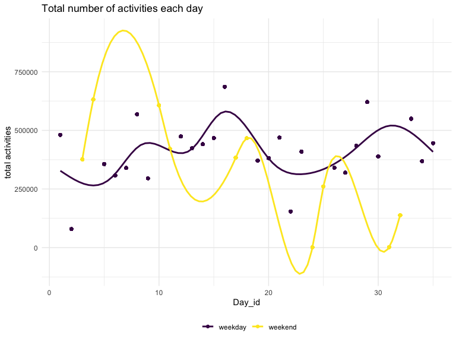

P8105_hw3_qx2222
================
Qiaoyi Xu
2022-10-12

### Problem 1(answer posted)

\##my answer:

``` r
library(p8105.datasets)
data("instacart")
```

How many aisles are there, and which aisles are the most items ordered
from? There are 134 aisles. fresh fruits and fresh vegetables are the
most items ordered from.

Make a plot that shows the number of items ordered in each aisle,
limiting this to aisles with more than 10000 items ordered. Arrange
aisles sensibly, and organize your plot so others can read it.

``` r
instacart %>% 
  group_by(aisle)%>%
  summarise(n_each_aisle = n()) %>%
  filter(n_each_aisle >= 10000) %>%
  arrange(desc(n_each_aisle)) %>%
  mutate(ordernumber_level = if_else(n_each_aisle <= 20000, "<=20k",
                                     if_else(n_each_aisle <= 30000 & n_each_aisle > 20000, "20k-30k",
                                             if_else(n_each_aisle <= 40000 & n_each_aisle > 30000, "30k-40k",
                                                     if_else(n_each_aisle <= 50000 & n_each_aisle > 40000, "40k-50k",
                                                             if_else(n_each_aisle > 50000, ">50k", NA_character_))))))%>%
  mutate(ordernumber_level = factor(ordernumber_level, levels = c(">50k", "40k-50k", "30k-40k", "20k-30k","<=20k")))%>%
  ggplot(aes(x = aisle, y = n_each_aisle)) +
  geom_col() +
  facet_wrap(vars(ordernumber_level), ncol = 1) +
  labs(title = "number of orders on each item", y = "number of orders") +
  theme_bw(base_size = 5) +
  theme(axis.text.x = element_text(face="bold", color="#993333", size=6, angle=45))
```


\##answer:

#### Read in the data

``` r
instacart = 
  instacart %>% 
  as_tibble(instacart)
```

#### Answer questions about the data

This dataset contains 1384617 rows and 15 columns, with each row
resprenting a single product from an instacart order. Variables include
identifiers for user, order, and product; the order in which each
product was added to the cart. There are several order-level variables,
describing the day and time of the order, and number of days since prior
order. Then there are several item-specific variables, describing the
product name (e.g. Yogurt, Avocado), department (e.g. dairy and eggs,
produce), and aisle (e.g. yogurt, fresh fruits), and whether the item
has been ordered by this user in the past. In total, there are 39123
products found in 131209 orders from 131209 distinct users.

Below is a table summarizing the number of items ordered from aisle. In
total, there are 134 aisles, with fresh vegetables and fresh fruits
holding the most items ordered by far.

``` r
instacart %>% 
  count(aisle) %>% 
  arrange(desc(n))
```

    ## # A tibble: 134 × 2
    ##    aisle                              n
    ##    <chr>                          <int>
    ##  1 fresh vegetables              150609
    ##  2 fresh fruits                  150473
    ##  3 packaged vegetables fruits     78493
    ##  4 yogurt                         55240
    ##  5 packaged cheese                41699
    ##  6 water seltzer sparkling water  36617
    ##  7 milk                           32644
    ##  8 chips pretzels                 31269
    ##  9 soy lactosefree                26240
    ## 10 bread                          23635
    ## # … with 124 more rows

Next is a plot that shows the number of items ordered in each aisle.
Here, aisles are ordered by ascending number of items.

``` r
instacart %>% 
  count(aisle) %>% 
  filter(n > 10000) %>% 
  mutate(aisle = fct_reorder(aisle, n)) %>% 
  ggplot(aes(x = aisle, y = n)) + 
  geom_point() + 
  labs(title = "Number of items ordered in each aisle") +
  theme(axis.text.x = element_text(angle = 60, hjust = 1))
```


Our next table shows the three most popular items in aisles
`baking ingredients`, `dog food care`, and `packaged vegetables fruits`,
and includes the number of times each item is ordered in your table.

``` r
instacart %>% 
  filter(aisle %in% c("baking ingredients", "dog food care", "packaged vegetables fruits")) %>%
  group_by(aisle) %>% 
  count(product_name) %>% 
  mutate(rank = min_rank(desc(n))) %>% 
  filter(rank < 4) %>% 
  arrange(desc(n)) %>%
  knitr::kable()
```

| aisle                      | product_name                                  |    n | rank |
|:---------------------------|:----------------------------------------------|-----:|-----:|
| packaged vegetables fruits | Organic Baby Spinach                          | 9784 |    1 |
| packaged vegetables fruits | Organic Raspberries                           | 5546 |    2 |
| packaged vegetables fruits | Organic Blueberries                           | 4966 |    3 |
| baking ingredients         | Light Brown Sugar                             |  499 |    1 |
| baking ingredients         | Pure Baking Soda                              |  387 |    2 |
| baking ingredients         | Cane Sugar                                    |  336 |    3 |
| dog food care              | Snack Sticks Chicken & Rice Recipe Dog Treats |   30 |    1 |
| dog food care              | Organix Chicken & Brown Rice Recipe           |   28 |    2 |
| dog food care              | Small Dog Biscuits                            |   26 |    3 |

Finally is a table showing the mean hour of the day at which Pink Lady
Apples and Coffee Ice Cream are ordered on each day of the week. This
table has been formatted in an untidy manner for human readers. Pink
Lady Apples are generally purchased slightly earlier in the day than
Coffee Ice Cream, with the exception of day 5.

``` r
instacart %>%
  filter(product_name %in% c("Pink Lady Apples", "Coffee Ice Cream")) %>%
  group_by(product_name, order_dow) %>%
  summarize(mean_hour = mean(order_hour_of_day)) %>%
  spread(key = order_dow, value = mean_hour) %>%
  knitr::kable(digits = 2)
```

    ## `summarise()` has grouped output by 'product_name'. You can override using the
    ## `.groups` argument.

| product_name     |     0 |     1 |     2 |     3 |     4 |     5 |     6 |
|:-----------------|------:|------:|------:|------:|------:|------:|------:|
| Coffee Ice Cream | 13.77 | 14.32 | 15.38 | 15.32 | 15.22 | 12.26 | 13.83 |
| Pink Lady Apples | 13.44 | 11.36 | 11.70 | 14.25 | 11.55 | 12.78 | 11.94 |

### Problem 2

1.  Load, tidy, and otherwise wrangle the data. Your final dataset
    should include all originally observed variables and values; have
    useful variable names; include a weekday vs weekend variable; and
    encode data with reasonable variable classes.

``` r
accel_data = read_csv("data/accel_data.csv") %>%
  janitor::clean_names() %>%
  pivot_longer(cols = "activity_1":"activity_1440", names_to = "time", values_to = "activities" )%>%
  separate(time, c("repeatedword","minute"), sep = "_") %>%
  select(-repeatedword) %>%
  arrange(week, day) %>%
  mutate(minute = as.integer(minute)) %>%
  mutate(weekday_or_weekend = if_else(day %in% c("Saturday", "Sunday"), "weekend", "weekday" )) %>%
  mutate(weekday_or_weekend = factor(weekday_or_weekend))
```

    ## Rows: 35 Columns: 1443
    ## ── Column specification ────────────────────────────────────────────────────────
    ## Delimiter: ","
    ## chr    (1): day
    ## dbl (1442): week, day_id, activity.1, activity.2, activity.3, activity.4, ac...
    ## 
    ## ℹ Use `spec()` to retrieve the full column specification for this data.
    ## ℹ Specify the column types or set `show_col_types = FALSE` to quiet this message.

``` r
accel_data
```

    ## # A tibble: 50,400 × 6
    ##     week day_id day    minute activities weekday_or_weekend
    ##    <dbl>  <dbl> <chr>   <int>      <dbl> <fct>             
    ##  1     1      1 Friday      1       88.4 weekday           
    ##  2     1      1 Friday      2       82.2 weekday           
    ##  3     1      1 Friday      3       64.4 weekday           
    ##  4     1      1 Friday      4       70.0 weekday           
    ##  5     1      1 Friday      5       75.0 weekday           
    ##  6     1      1 Friday      6       66.3 weekday           
    ##  7     1      1 Friday      7       53.8 weekday           
    ##  8     1      1 Friday      8       47.8 weekday           
    ##  9     1      1 Friday      9       55.5 weekday           
    ## 10     1      1 Friday     10       43.0 weekday           
    ## # … with 50,390 more rows

Describe the resulting dataset:

This cleaned dataset has 50400 observations and 6 varibales, such as
week, day_id, day, minute, activities, weekday_or_weekend. In those
varibales, week,day_id, day, minute shows the exact time of collected
data. variable activities shows the number of activity happened in each
time. Finally, weekday_or_weekend variable we created shows data
collected in weekday or weekend.

2.  Using your tidied dataset, aggregate across minutes to create a
    total activity variable for each day, and create a table showing
    these totals. Are any trends apparent?

``` r
totals_table  = accel_data %>% group_by(day_id) %>%
  mutate(total = sum(activities))

totals_table
```

    ## # A tibble: 50,400 × 7
    ## # Groups:   day_id [35]
    ##     week day_id day    minute activities weekday_or_weekend   total
    ##    <dbl>  <dbl> <chr>   <int>      <dbl> <fct>                <dbl>
    ##  1     1      1 Friday      1       88.4 weekday            480543.
    ##  2     1      1 Friday      2       82.2 weekday            480543.
    ##  3     1      1 Friday      3       64.4 weekday            480543.
    ##  4     1      1 Friday      4       70.0 weekday            480543.
    ##  5     1      1 Friday      5       75.0 weekday            480543.
    ##  6     1      1 Friday      6       66.3 weekday            480543.
    ##  7     1      1 Friday      7       53.8 weekday            480543.
    ##  8     1      1 Friday      8       47.8 weekday            480543.
    ##  9     1      1 Friday      9       55.5 weekday            480543.
    ## 10     1      1 Friday     10       43.0 weekday            480543.
    ## # … with 50,390 more rows

``` r
totals_table %>%
  ggplot(aes(x = day_id, y = total, color = weekday_or_weekend )) + 
  geom_point() +
  labs(x = "Day_id", y = "total activities", title = "Total number of activities each day", 
       color = "weekday/weekend") +
  geom_smooth(se = FALSE) +
  theme_minimal() +
  theme(legend.position = "bottom",
        legend.title = element_blank())
```

    ## `geom_smooth()` using method = 'gam' and formula 'y ~ s(x, bs = "cs")'



From the plot we got, we could see the line showed total activities
counts on weekday is more stable, compared with the line of weekend.
Besides, for the total activities counts on weekday has sightly
increasing trend. But for the total activities counts on weekend has
sightly decreasing trend.

3.  Accelerometer data allows the inspection activity over the course of
    the day. Make a single-panel plot that shows the 24-hour activity
    time courses for each day and use color to indicate day of the week.
    Describe in words any patterns or conclusions you can make based on
    this graph.

``` r
accel_data %>%
  mutate(hour = minute/60) %>%
  ggplot(aes(x = hour, y = activities, color = day)) +
  geom_point() +
  geom_line(alpha = .5) +
  geom_smooth(aes(group = day), se = FALSE) +
  labs(x = "Hour", y = "number of activities", title = "the 24-hour activity time courses for each day", 
       color = "Day of week")
```

    ## `geom_smooth()` using method = 'gam' and formula 'y ~ s(x, bs = "cs")'


From this single-panel plot that shows the 24-hour activity time courses
for each day, we could see lower total activities counts on morning time
(before 5am) each day and higher total activities counts on evening time
(around 6pm-10pm). Then, from the smooth lines, it also shows total
activities counts on evening time is greater than other time on most of
days, especially on Friday.

### Problem 3

``` r
#load data of problem 3
library(p8105.datasets)
data("ny_noaa")
```

To that end, write a short description of the dataset, noting the size
and structure of the data, describing some key variables, and indicating
the extent to which missing data is an issue. Then, do or answer the
following (commenting on the results of each):

1.  Do some data cleaning. Create separate variables for year, month,
    and day. Ensure observations for temperature, precipitation, and
    snowfall are given in reasonable units. For snowfall, what are the
    most commonly observed values? Why?

``` r
clean_noaa = ny_noaa %>%
  separate(date, c("year","month","day"), sep = "-") %>%
  mutate(year = as.numeric(year),
         month = as.numeric(month),
         day = as.numeric(day),
         tmax = as.numeric(tmax)/10,
         tmin = as.numeric(tmin)/10,
         prcp = as.numeric(prcp)/10)

clean_noaa
```

    ## # A tibble: 2,595,176 × 9
    ##    id           year month   day  prcp  snow  snwd  tmax  tmin
    ##    <chr>       <dbl> <dbl> <dbl> <dbl> <int> <int> <dbl> <dbl>
    ##  1 US1NYAB0001  2007    11     1    NA    NA    NA    NA    NA
    ##  2 US1NYAB0001  2007    11     2    NA    NA    NA    NA    NA
    ##  3 US1NYAB0001  2007    11     3    NA    NA    NA    NA    NA
    ##  4 US1NYAB0001  2007    11     4    NA    NA    NA    NA    NA
    ##  5 US1NYAB0001  2007    11     5    NA    NA    NA    NA    NA
    ##  6 US1NYAB0001  2007    11     6    NA    NA    NA    NA    NA
    ##  7 US1NYAB0001  2007    11     7    NA    NA    NA    NA    NA
    ##  8 US1NYAB0001  2007    11     8    NA    NA    NA    NA    NA
    ##  9 US1NYAB0001  2007    11     9    NA    NA    NA    NA    NA
    ## 10 US1NYAB0001  2007    11    10    NA    NA    NA    NA    NA
    ## # … with 2,595,166 more rows

``` r
snowball_values = ny_noaa %>%
  group_by(snow) %>%
  summarise(snowball_obs = n())%>%
  arrange(desc(snowball_obs))

snowball_values
```

    ## # A tibble: 282 × 2
    ##     snow snowball_obs
    ##    <int>        <int>
    ##  1     0      2008508
    ##  2    NA       381221
    ##  3    25        31022
    ##  4    13        23095
    ##  5    51        18274
    ##  6    76        10173
    ##  7     8         9962
    ##  8     5         9748
    ##  9    38         9197
    ## 10     3         8790
    ## # … with 272 more rows

2.  Make a two-panel plot showing the average max temperature in January
    and in July in each station across years. Is there any observable /
    interpretable structure? Any outliers?

``` r
average_maxtemp = clean_noaa %>%
  mutate(month = month.name[month]) %>%
  filter(month %in% c ("January", "July")) %>%
  group_by(id,year,month) %>%
  summarise(mean_tmax = mean(tmax, na.rm = T)) %>%
  filter(!is.na(mean_tmax)) %>%#clean missing data
  ggplot(aes(x = year, y = mean_tmax))+
  geom_point() +
  geom_smooth(se = FALSE) +
  facet_grid(.~month) +
  theme(panel.spacing = unit(1,"lines")) %>%
  labs(x = "Year", y = "Average Max Temperature",
       title = "the average max temperature in January and in July in each station")
```

    ## `summarise()` has grouped output by 'id', 'year'. You can override using the
    ## `.groups` argument.

``` r
average_maxtemp 
```

    ## `geom_smooth()` using method = 'gam' and formula 'y ~ s(x, bs = "cs")'


3.  Make a two-panel plot showing

<!-- -->

1)  tmax vs tmin for the full dataset (note that a scatterplot may not
    be the best option);

``` r
tmax_vs_tmin = clean_noaa %>%
  ggplot(aes(x = tmin, y = tmax))+
  geom_hex() +
  labs(x = "Minimum temperature (tenths of degrees C)", y = "Maximum temperature (tenths of degrees C)", 
       title = "tmax vs tmin for the full dataset", fill = "counts") +
  scale_x_continuous(n.breaks = 6) +
  scale_fill_continuous(breaks = c(10000,30000,50000)) +
  theme_minimal() +
  theme(legend.position = "bottom")

tmax_vs_tmin
```


2)  make a plot showing the distribution of snowfall values greater than
    0 and less than 100 separately by year.

``` r
dist_snowfall = clean_noaa %>%
  filter(snow>0&snow<100) %>%
  mutate(year = factor(year)) %>%
  ggplot(aes(x = snow, y = year, fill = year))+
  geom_density_ridges(alpha = .5, scale = 2) +
  labs(x = "Snowfall(mm)", y = "year", title = "the distribution of snowfall values by year")

dist_snowfall  
```

    ## Picking joint bandwidth of 3.76


Finally, combine this two plot into a two-panel plot.

``` r
final_two_panel = tmax_vs_tmin + dist_snowfall 

final_two_panel
```

    ## Picking joint bandwidth of 3.76


